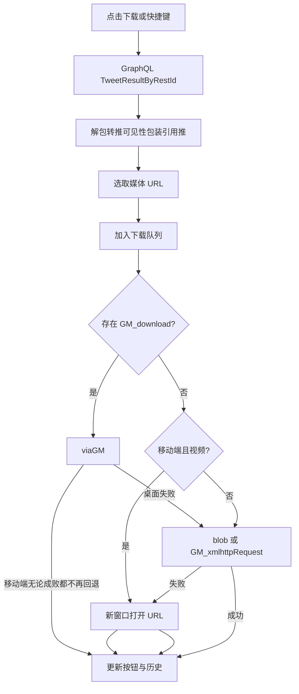
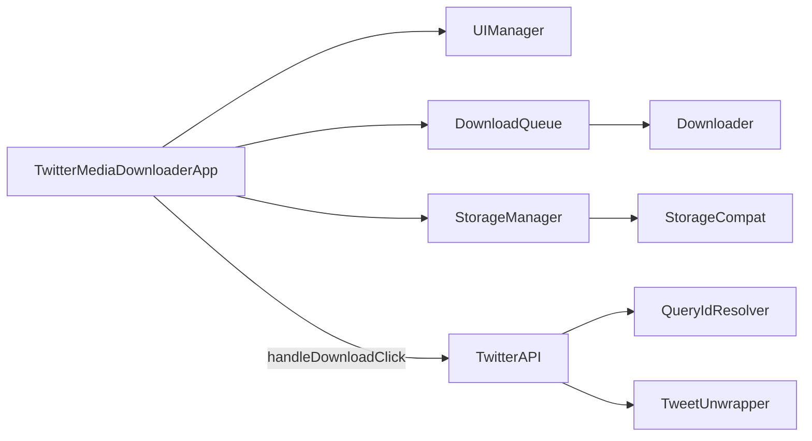

# TXD-s-Twitter-or-X-s-Downloader

一键下载 Twitter / X 的图片与视频，支持自定义文件名、下载历史、主题与语言、桌面快捷键与移动端浮动按钮。

当前脚本版本：**26.09.11**  
作者：**ONO's'Not Organization**  
协议：**AGPL-3.0**  
仓库：[github.com/ONO-s-Not-Organization/TXD-s-Twitter-or-X-s-Downloader](https://github.com/ONO-s-Not-Organization/TXD-s-Twitter-or-X-s-Downloader)  
Issue：[Issues](https://github.com/ONO-s-Not-Organization/TXD-s-Twitter-or-X-s-Downloader/issues)

本项目基于 [ShanksSU/twitter-media-downloader](https://github.com/ShanksSU/twitter-media-downloader)。原代码仍按 MIT 许可；修改后的合成作品按 AGPL-3.0 许可。

---

## 目录

- [项目简介](#项目简介)
- [功能一览](#功能一览)
- [安装](#安装)
- [运行范围与权限](#运行范围与权限)
- [界面与操作](#界面与操作)
- [按钮状态](#按钮状态)
- [设置](#设置)
- [文件名模板](#文件名模板)
- [下载行为](#下载行为)
- [历史记录](#历史记录)
- [QueryId 与 Bearer 自愈](#queryid-与-bearer-自愈)
- [架构](#架构)
- [错误与 Toast](#错误与-toast)
- [限制与隐私](#限制与隐私)
- [故障排查](#故障排查)
- [许可与致谢](#许可与致谢)

---

## 项目简介

TXD 是一份用户脚本（`TXD.user.js`），在 `twitter.com` / `x.com` 及其移动域上注入下载按钮。点击后通过站点 GraphQL 接口 `TweetResultByRestId` 拉取推文媒体，再按你配置的文件名规则保存。

脚本假定你**已经登录** Twitter / X。请求会带上当前页面 Cookie 中的：

- `ct0`：作为 `x-csrf-token`
- `gt`：若存在则作为 `x-guest-token`
- `lang`：作为 `x-twitter-client-language`（缺省为 `en`）

未登录或 CSRF 缺失时，接口很容易失败。脚本**不会**替你登录，也**不会**批量抓取某个用户主页的全部媒体。

内置界面语言：英文、简体中文。界面语言可手动指定，或跟随页面 `html.lang`（`zh` / `zh-*` 用中文，其余用英文）。

---

## 功能一览

- 时间线 / 详情推文操作栏增加「下载」按钮（克隆分享按钮位置）
- 同一条推文有多张图 / 多个视频时，在单张媒体上叠加独立下载按钮
- 灯箱（`role="dialog"`）与媒体列表（`li[role="listitem"]`）同样注入按钮
- 左下角（桌面）或右下角可拖动（移动）的历史记录浮动按钮（FAB）
- 设置面板：文件名模板、历史开关、自动书签、快捷键、主题、语言、历史上限、下载超时
- 下载时可选自动点击该书签按钮（每条推文会话内只点一次）
- GraphQL `queryId` 与 `Authorization` Bearer 过期后自动拦截 / 解析 / 重试
- 桌面键盘快捷键（默认 `D`）下载当前悬停推文或灯箱中的媒体
- 浅色 / 深色 / 跟随系统主题；尊重 `prefers-reduced-motion`

**没有的功能（请勿按下列预期使用）：**

- 批量下载整个时间线或用户主页
- HLS / `m3u8` 视频转封装
- 字幕、音频轨选择、画质菜单
- 云端同步历史
- 未登录游客模式保证可用

---

## 安装

### 脚本管理器

需要能运行 UserScript 的扩展，并尽量支持下列 GM API：

- `GM_setValue` / `GM_getValue` 或 `GM.setValue` / `GM.getValue`
- `GM_download` 或 `GM.download`（强烈建议，尤其是移动端）
- `GM_addStyle`
- `GM_xmlhttpRequest`（桌面 blob 回退下载会用到）

常见选择：Tampermonkey、Violentmonkey。部分移动浏览器（例如 Via）只要实现了 `GM_download`，脚本会走「交给管理器下载」路径，并且**不会再回退到 blob / 新窗口**，以避免二次触发下载。

### 安装地址

脚本头中的安装与更新 URL：

```
https://raw.githubusercontent.com/ONO-s-Not-Organization/TXD-s-Twitter-or-X-s-Downloader/main/TXD.user.js
```

管理器会按同一地址检查更新。安装后打开任意 `https://x.com/*` 或 `https://twitter.com/*` 页面即可；注入时机为 `document-idle`。

### 首次使用建议

1. 确认已登录 X。
2. 刷一条带图片的推文，操作栏应出现下载图标。
3. 点左下角（桌面）或右下角（移动）日志图标打开历史 / 设置，按需改文件名模板。

---

## 运行范围与权限

摘自脚本 UserScript 头：

| 项 | 值 |
|---|---|
| `@name` | TXD-s-Twitter-or-X-s-Downloader |
| `@name:zh-CN` | TXD-是-推特-或-X-的-下载器 |
| `@namespace` / `@homepageURL` | 见上文 GitHub 仓库 |
| `@match` | `https://twitter.com/*`、`https://x.com/*`、`https://mobile.twitter.com/*`、`https://mobile.x.com/*` |
| `@run-at` | `document-idle` |
| `@connect` | `twimg.com` |
| `@icon` | Google favicon 服务上的 `x.com` 图标 |
| `@license` | AGPL-3.0 |

`@connect twimg.com` 用于跨域拉取媒体（`GM_xmlhttpRequest` / `GM_download`）。GraphQL 请求打在当前主机的 `/i/api/graphql/...`，走页面 `fetch` 与登录 Cookie，不另列 `@connect`。

---

## 界面与操作

脚本用 `EnvDetect` 判断环境：

- **移动端**：`pointer: coarse`，或 UA 匹配 `android|iphone|ipad|ipod|mobile|via`
- **是否有 GM 下载**：存在 `GM_download` 或 `GM.download`
- **下载并发**：移动端 `1`，桌面 `2`

`html` 上会加上 `tmd-mobile` 或 `tmd-desktop`，并加上 `tmd-theme-light` / `tmd-theme-dark`。

### 桌面

- **工具栏按钮**：有媒体的 `article` 上，脚本在操作栏最后的分享按钮后插入克隆节点，把 SVG 换成下载图标。
- **单张覆盖层**：同一推文匹配到多个 `a[href*="/photo/"]` 或 `a[href*="/video/"]` 时，在每张父节点右下角放 `.tmd-img`。默认隐藏，悬停该媒体、或按钮处于 loading / completed / exist / failed 时显示。
- **灯箱**：`[role="dialog"]` 内的 article、listitem、以及带 `/status/.../photo|video/` 的链接都会补按钮。
- **快捷键**：默认字母 `D`（可在设置里改成任意单字符）。下列情况**不触发**：焦点在 `INPUT` / `TEXTAREA` / `SELECT`、正在编辑 `contentEditable`、设置/历史弹窗已打开。目标容器优先为最近 `mouseover` 过的 `article` / `[role="dialog"]` / `div[aria-labelledby]`；无效则退到当前灯箱或第一条 `article`。优先点击悬停中的 `.tmd-img` / `.tmd-media`，否则点该容器里第一个 `.tmd-down`。按钮已在 `loading` 时快捷键不会再点。
- **历史 FAB**：固定在左下（`left: 16px; bottom: 24px`），点击打开弹窗。桌面弹窗居中，最大宽度约 850px。点遮罩关闭；打开后 400ms 内忽略遮罩点击，避免误关。

### 移动端

- 单张覆盖层**始终显示**，触控区域至少约 44×44px，半透明深色底。
- 视频/灯箱媒体按钮使用 `.tmd-media`。
- **FAB**：默认右下，避开底部安全区（`bottom: calc(16px + env(safe-area-inset-bottom) + 104px)`），圆形 48px。可拖动；移动超过约 8px 视为拖动并写入 `tmd_fab_pos`（`{x, y}`），松手不打开弹窗。位置会夹在窗口范围内。关闭弹窗后 400ms 内 FAB 点击无效（`_fabQuietUntil`），防止点到刚露出来的按钮。
- **弹窗**：底部 sheet，顶部有拖动手柄；在手柄或标题栏向下拖超过约 80px 关闭。语言、主题改到设置页里用下拉框（桌面则在弹窗标题栏）。
- 没有快捷键设置行，也没有「下载超时」下拉（超时仍用于内部 GM/blob，默认 45 秒）。

### 自动书签

设置开启后，点下载按钮会同时寻找该 `article` 内 `button[data-testid="bookmark"]` 并 `click()`。用内存 `Set` 记住已点过的 `status_id`，同一页面会话内不会对同一条推重复点。灯箱里若没有对应 bookmark 按钮则什么也不做。

---

## 按钮状态

| CSS 类 | 含义 | 再次点击 |
|---|---|---|
| `download` | 可下载 | 开始下载 |
| `loading` | 请求中 / 排队下载 | 忽略 |
| `completed` | 本次下载判定成功 | 忽略 |
| `exist` | 历史里已有该推文 ID | 忽略 |
| `failed` | 失败 | 可再点重试（会先进入 loading） |

成功时图标变绿并播放弹出 / 粒子动画。`exist` 不播放粒子。若系统 `prefers-reduced-motion: reduce`，完成动画、粒子和 loading 旋转都会关掉。

移动端成功提示标题用「已开始下载」（`started`），桌面用「下载完成」（`completed`），因为移动端 GM 往往只是把任务交给系统，并不等待文件落盘。

---

## 设置

打开历史弹窗后点齿轮进入设置。文件名在输入时就会写入存储；点「保存 / 完成」只提示「已保存」并关窗。模板为空时预览报错且完成按钮禁用，不会把空字符串存进去。

### 存储优先级

`StorageCompat` 读写顺序：

1. `GM.getValue` / `GM.setValue`（若存在）
2. `GM_getValue` / `GM_setValue`（同步或 Promise 都支持）
3. 失败则 `localStorage`，键前缀 `tmd_ls_`，值为 JSON

GM 不可用或抛错时静默落到 localStorage；localStorage 配额满则忽略写入。

### 设置项对照

与 `StorageManager.SETTING_FIELDS` 及 `init()` 读取的键一致。

| 存储键 | 内存字段 | 默认 | 可选值 | 说明 |
|---|---|---|---|---|
| `filename` | `filenamePattern` | `{user-name}_@{user-id}_{status-id}` | 非空字符串 | 文件名模板，换行会被去掉 |
| `save_history` | `saveHistoryFlag` | `true` | 布尔 | 关闭后下载成功也不写历史 |
| `auto_bookmark` | `autoBookmarkFlag` | `false` | 布尔 | 下载时自动点书签 |
| `shortcut_key` | `shortcutKey` | `D` | 单字符，输入会转大写 | 仅桌面设置 UI |
| `tmd_theme` | `theme` | `auto` | `auto` / `light` / `dark` | 非法值回退 `auto` |
| `tmd_lang` | `lang` | `auto` | `auto` / `en` / `zh` | 非法值回退 `auto` |
| `history_limit` | `historyLimit` | `500` | `100` / `500` / `1000` / `0` | `0` 表示不限制；不在列表中的数字回退 500 |
| `download_timeout` | `downloadTimeoutMs` | `45000` | `30000` / `45000` / `90000` | 仅桌面设置 UI；非法值回退 45000 |
| `tmd_fab_pos` | `fabPos` | `null` | `{x:number,y:number}` | 仅移动端拖动 FAB 时写入 |
| `tmd_query_id` | `queryId` | `2ICDjqPd81tulZcYrtpTuQ` | 字符串 | 自动维护，一般不用手改 |
| `tmd_bearer` | `bearer` | 脚本内置 Bearer | 字符串 | 拦截到页面 Authorization 后覆盖 |
| `download_history` | `history` | `[]` | 对象数组 | 见[历史记录](#历史记录) |

历史条数超过上限时**丢掉最旧的**，只留末尾 `limit` 条。旧版本若把历史存成纯字符串 ID，加载时会转成 `{ id, time: null }`。

### 主题解析

`auto` 时：先看 `prefers-color-scheme: dark`；再看 `html` 计算背景 RGB 均值是否小于 80；否则浅色。桌面标题栏太阳/月亮/对半圆图标循环：`auto → light → dark → auto`。移动端用下拉框。

### 语言解析

手动 `en` / `zh` 直接用对应字典。`auto` 时读 `document.documentElement.lang`：`zh` 或 `zh-*` → 中文，`en` 或 `en-*` → 英文，其它 → 英文。

改语言会关窗再按当前视图重开，以便整页文案刷新。

---

## 文件名模板

默认：

```
{user-name}_@{user-id}_{status-id}
```

最终文件名由 `Utils.buildFilename` 生成：去掉模板里已有的 `.{file-ext}`（若写了），再拼接扩展名。下载时扩展名是占位 `{file-ext}`，随后被实际后缀替换；设置里的预览则用字面量 `.jpg`。

### 可用标签

设置页点击标签会插入到光标处。中英文说明来自 `Config.language.*.dialog.tags`。

| 标签 | 含义 | 数据来源 |
|---|---|---|
| `{user-name}` | 作者显示名 | GraphQL user `name`，已做文件名清洗 |
| `{user-id}` | 作者账号 | `screen_name` 或 `username` |
| `{status-id}` | 推文数字 ID | 按钮上解析的 status id |
| `{date-time}` | 发帖时间（UTC） | `legacy.created_at` + 日期格式 |
| `{date-time-local}` | 发帖时间（本地） | 同上，先减时区偏移再按 UTC 字段格式化 |
| `{full-text}` | 推文正文 | 长推 `note_tweet` 优先，否则 `full_text`；去掉 `https://t.co/...`，清洗非法字符后截断 |
| `{fav-count}` | 点赞数 | `legacy.favorite_count`，缺省 `0` |
| `{file-type}` | 媒体类型 | `photo` / `video` / `gif`（会去掉 `animated_` 前缀） |
| `{file-name}` | 原始文件名（无扩展名） | 媒体 URL 最后一段去掉查询串和 `:orig` 等 |
| `{media-count}` | 该推文媒体总数 | 解包后的数组长度（单张下载时仍是总数） |
| `{index}` | 当前媒体序号 | 覆盖层从 URL `/photo/N` 或 `/video/N` 来；整推下载则为 1-based 循环下标 |
| `{rt-user-name}` | 转帖者显示名 | 时间线 `socialContext` 文案（最后一个空格前） |
| `{rt-user-id}` | 转帖者账号 | `socialContext` 所在链接的 path（去掉开头 `/`） |

另外还有**隐式** `{file-ext}`（jpg/mp4 等），设置标签列表里没有单独按钮。未知 `{tag}` 替换为空字符串。

转帖下载时，GraphQL 会解包到**原推**，因此 `{user-name}` / `{user-id}` 是原作者，`{rt-*}` 才是转帖者。灯箱媒体列表注入的按钮可能拿不到转帖者，此时为 `unknown`。

### 高级语法

提示原文：`{date-time:YYYYMMDD}`、`{date-time-local:…}`、`{full-text:50}`。

- **自定义日期格式**：`{date-time:格式}` 或 `{date-time-local:格式}`。未写格式时默认 `YYYYMMDD-hhmmss`。格式里的 `\ / | < > * ? : "` 会按非法字符表替换。
- **正文长度**：`{full-text:数字}`，未写时长度为 `999`。

日期格式 token（`Utils.formatDate`）：

| Token | 含义 |
|---|---|
| `YYYY` | 四位年 |
| `YY` | 两位年 |
| `MM` | 月（补零） |
| `MMM` | 月缩写 `JAN`…`DEC` |
| `DD` | 日 |
| `hh` | 小时 00–23 |
| `mm` | 分钟 |
| `ss` | 秒 |
| `h2` | 12 小时制小时 |
| `ap` | `AM` / `PM` |

替换时用 `('0' + value).slice(-tokenLength)`，因此 `MMM` 这类已是三字母的也能对上。

### 非法字符替换

文件名片段会替换：

| 原字符 | 替换为 |
|---|---|
| 换行、制表符 | 全角空格 `　` |
| `\` | `⧹` |
| `/` | `⧸` |
| `\|` | `｜` |
| `:` | `꞉` |
| `*` | `＊` |
| `?` | `？` |
| `"` | `″` |
| `<` | `＜` |
| `>` | `＞` |
| U+200B / 200C / 200D / 2060 / FEFF（零宽等） | 删除 |
| 🔞 | 删除 |

### 设置页预览示例数据

```
status-id: 114514
user-name: 博麗神主
user-id: korindo
rt-user-name: 芙兰朵露
rt-user-id: Flandre
fav-count: 325
file-type: type
file-name: original_pic
media-count: 7
index: 1
full-text: Full Text（再按长度截断）
date-time / date-time-local: 当前时间
扩展名预览: .jpg
```

点「重置」恢复默认模板并立刻保存。

---

## 下载行为

### 总流程



### 拉取推文

`TwitterAPI.fetchTweetJson`：

- URL：`https://{当前主机}/i/api/graphql/{queryId}/TweetResultByRestId`
- Query：`variables`（`tweetId`、若干 `with*` 开关）+ 固定 `features` JSON
- Header：`authorization`、`x-twitter-active-user: yes`、`x-twitter-client-language`、可选 CSRF / guest token
- `credentials: 'include'`

HTTP 非 2xx：若尚未强制刷新且状态为 400/404，会强制解析新 queryId 并重试一次；否则抛 `API_ERROR`。  
JSON 里解包后没有 `legacy`：同样尝试刷新 queryId；仍失败则抛 `API_EXPIRED`。

### 媒体解包（`TweetUnwrapper`）

1. `TweetWithVisibilityResults.tweet` 或嵌套 `.tweet`
2. 若是转推，递归解包 `retweeted_status_result`（**下载原推媒体**）
3. 正文：`note_tweet` 长文 > `legacy.full_text` > `full_text`
4. 媒体：`legacy.extended_entities.media` 或 `entities.media`；自身没有则看引用推 `quoted_status_result`

单张按钮会按 URL 中的 `/photo/N` 或 `/video/N` 只保留第 N 项（1-based）。一个都没有则 `MEDIA_NOT_FOUND`。

### URL 选择

**图片**

- 主地址：已有 `:orig|:large|...` 则原样，否则加 `:orig`
- 回退：`:large`，以及去掉尺寸后缀的地址（去重且不等于主地址）

**视频 / GIF**

- 在 `video_info.variants` 里筛 `video/mp4`，取 **bitrate 最高** 的一条
- 没有 mp4 则用任意带 `url` 的 variant
- 若该 URL 像 `m3u8`，标记 `maybeHls`
- **HLS 任务直接计失败**，不会入队下载（`picked.maybeHls` 时 `failCount++`）

### 队列与重试（`DownloadQueue`）

- 桌面最多 2 个同时进行；每个 URL 最多再试 2 次（共 3 次），然后换备用 URL
- 移动端同时 1 个，**额外重试次数为 0**（每个 URL 只试 1 次），仍会遍历备用 URL 列表

### `Downloader` 三条路径

1. **`viaGM`**  
   调用 `GM_download({ url, name, onload, onerror, ontimeout })`。  
   桌面：`onload` 成功；`onerror` / 超时（可 abort）失败。超时时长用设置里的 `downloadTimeoutMs`。  
   移动端：下一帧就 `finish(true)`（视为已交给系统）；`ontimeout` 也当成功。  
   **移动端只要走了 GM，无论 ok 与否都不再 blob / openUrl**，避免 Via 等浏览器打出两次下载。

2. **`viaBlob`**  
   优先 `GM_xmlhttpRequest`（`responseType: 'blob'`），否则 `fetch`（`credentials: 'omit'`）。超时用 `AbortController`。然后用隐藏 `<a download>` 点击保存，约 1.5 秒后释放 Object URL。

3. **`openUrl`**  
   `window.open(url, '_blank')`，Toast：中文「已打开媒体链接，请用系统下载或长按保存。」成功返回 `{ ok: true, opened: true }`。

### 何时算整次下载成功

对本次实际入队的每个媒体计数 `successCount` / `failCount`：

- **桌面**：必须 `failCount === 0` 才标 `completed` 并写历史；部分成功则 `PARTIAL`
- **移动**：`successCount > 0` 即成功（因为打开链接 / 交给 GM 就算 ok）
- 一个媒体都没有成功：`ERROR`（移动端在 success 为 0 时）

`completed` 之后才会 `persistHistoryAfterDownload`（且 `save_history` 为真）。

---

## 历史记录

成功下载后追加一条：

```js
{
  id: status_id,          // 推文 ID，也是去重键
  user: info['user-name'],
  type: medias.length > 1 ? 'Gallery' : (photo|video|gif),
  postTime: Date.parse(tweet.legacy.created_at),
  time: Date.now(),       // 下载时间
  thumb: media_url_https + ':small'  // 没有则空串
}
```

同一 `id` 已在 `historyIds` 里则不再追加。关闭「保存下载记录」则整段跳过。

### 桌面表格

列：缩图、用户、类型、贴文时间、下载时间、动作（前往 / 删除）。时间格式 `YYYY/MM/DD hh:mm`（本地）。缺时间显示「未知时间」。前往打开 `https://x.com/i/status/{id}`。

### 移动卡片

显示缩图、用户、`类型 · 下载时间`。点卡片（非删除按钮）打开推文。没有单独「前往」按钮。

### 分页

桌面与移动都是每次渲染 80 条，点「加载更多」再追加。列表按历史数组**倒序**（最新在上）。

### 删除

- 单条：浏览器 `confirm`，文案「删除这条记录？」
- 清空：标题栏垃圾桶或设置页按钮，文案「确认要清除下载记录？」

清空会把 `download_history` 写成 `[]`。

---

## QueryId 与 Bearer 自愈

X 前端 GraphQL 的 operation hash（`queryId`）和站点用的 Bearer 会变。脚本**不是破解接口**，只是尽量跟页面自己正在用的参数保持一致，避免写死哈希后全站下载失败。

`QueryIdResolver.installNetworkHook()` 在 `init` 最先执行：

- 包装 `window.fetch`：URL 匹配 `/i/api/graphql/{id}/TweetResultByRestId` 则记下 id；请求头里的 `authorization` 若像 Bearer 则记下
- 包装 `XMLHttpRequest.open/setRequestHeader/send`：同样捕获 URL 与 Authorization

解析优先级（`resolve`）：

1. 已拦截到的 id（除非 `forceRefresh`）
2. `performance.getEntriesByType('resource')` 里倒序找同一路径
3. 存储里的 `tmd_query_id`
4. 拉取页面上 `script[src*="responsive-web"]` 且像 `main.*.js` 的前 3 个，正则找 `TweetResultByRestId` 的 `queryId`
5. 仍没有则用内置 `DEFAULT_QUERY_ID`

Bearer：拦截值 > 存储 `tmd_bearer` > 脚本内置 `Config.AUTH_TOKEN`。若本次请求用的 Bearer 与存储不同会写回存储。成功的 queryId 也会写回。

内置 Bearer 与默认 queryId 只是启动兜底，随后应以页面真实请求为准。

---

## 架构

全部逻辑在单文件 [TXD.user.js](TXD.user.js)。入口：

```js
new TwitterMediaDownloaderApp().init();
```



### 类职责

| 类 | 职责 |
|---|---|
| `Config` | 常量、中英文字典、全部 CSS、下载/状态 SVG、弹窗图标 |
| `EnvDetect` | 移动端 / GM_download / 并发数 |
| `StorageCompat` | GM 与 localStorage 兼容层 |
| `Utils` | Cookie、日期格式、文件名清洗与拼接、DOM/`GM_addStyle`、Toast |
| `StorageManager` | 设置与历史的加载、校验、增删、截断 |
| `QueryIdResolver` | 拦截与解析 GraphQL hash / Bearer |
| `TweetUnwrapper` | 推文节点解包、正文、媒体列表、媒体 URL |
| `TwitterAPI` | 组装 features、发 GraphQL、错误码、过期重试 |
| `Downloader` | GM / blob / 开链接 |
| `DownloadQueue` | 并发泵、URL 回退、重试 |
| `UIManager` | 样式、主题、按钮注入、历史/设置弹窗、FAB 拖动 |
| `TwitterMediaDownloaderApp` | 组装、快捷键、MutationObserver、点击后编排下载与历史 |

### 按钮注入时机

`startObserver`：

1. 观察根优先 `[data-testid="primaryColumn"]`，否则 `main[role="main"]`，否则 `body`
2. `MutationObserver` 收集新增节点，`requestAnimationFrame` 批量处理，避免每条 mutation 都扫 DOM
3. 处理 `article`、媒体 `li[role="listitem"]`、以及「像灯箱」的节点（自身或子孙带 `role="dialog"`）
4. 若根不是 `body`，再在 `body` 上观察：主栏切换时重新 attach；新增灯箱节点单独调度
5. 启动时对已有 dialog 立刻 `addLightboxButtons`

同一 `article` 若 `data-tmd-status` 与当前解析出的 status id 不一致（虚拟列表复用），会拆掉旧按钮再绑。

识别「这条推有媒体」的选择器包括：`a[href*="/photo/1"]`、进度条、播放按钮、敏感内容设置链接、旧版 `media-image-container` 等。没有这些节点时**不插入工具栏下载按钮**（纯文字推不会出现下载）。

---

## 错误与 Toast

来自 `Config.language`。Toast 默认约 2.8 秒，固定在底部安全区之上，不接收点击。

| 代码 | 中文 | 英文 | 典型原因 |
|---|---|---|---|
| `API_ERROR` | 接口请求失败 | API request failed | GraphQL HTTP 失败 |
| `API_EXPIRED` | 接口已过期，正在重试… | API expired, retrying… | 解包不到 `legacy`（字典里带「正在重试」，实际抛给 UI 时通常已重试过） |
| `MEDIA_NOT_FOUND` | 未找到媒体 | No media found | 无 photo/video，或单张下标越界 |
| `ERROR` | 下载失败 | Download failed | 全部任务失败等 |
| `TIMEOUT` | 下载超时 | Download timed out | 桌面 GM/blob 超时 |
| `PARTIAL` | 部分文件下载失败 | Some files failed to download | 桌面多文件部分失败 |
| （Toast）`toast_open_url` | 已打开媒体链接，请用系统下载或长按保存。 | Opened media URL. Use system download or long-press to save. | `openUrl` |
| （Toast）`saved` | 已保存 | Saved | 设置页点完成 |

未知错误码会原样显示在按钮 title 和 Toast 上。

其它 UI 字符串（设置标题、历史空态、加载更多、主题名等）见脚本内 `Config.language`，README 不逐条复述。

---

## 限制与隐私

- 需要站点登录 Cookie；脚本会读 `ct0`、`gt`、`lang`（只这三项）。
- 可能把页面请求里的 Bearer 和 GraphQL queryId **缓存在本机** GM 存储或 `localStorage`（`tmd_ls_*`）。不会上传到第三方服务器。
- 历史包含显示名、媒体类型、推文 ID、缩略图 URL（`pbs.twimg.com` 一类地址）。缩略图加载走浏览器对 twimg 的请求。
- 不支持纯 HLS 视频；不保证广告推、社区帖、受限可见性等特殊 `typename` 都能解包。
- 引用推：仅当原推自己没有媒体时，才用引用推的媒体。
- 转推：下载的是原推媒体，文件名里的作者是原作者。
- 桌面并发为 2，短时间点很多按钮仍会排队，可能触发浏览器或站点限流。
- `@connect twimg.com` 允许管理器向 Twitter 图片/视频 CDN 发请求。

请只下载你有权保存的内容，并遵守 Twitter / X 服务条款与当地法律。

---

## 故障排查

**时间线上没有下载按钮**

- 该推文没有脚本能识别的媒体节点（纯文字、部分卡片）。
- 页面还在用非标准 DOM；可打开详情或灯箱再试。
- 确认脚本在当前域名匹配且已启用。

**灯箱里没有单张按钮**

- 链接需同时包含 `/status/` 与 `/photo/N` 或 `/video/N`。
- 父节点已有 `.tmd-img` 则不会重复插入。

**提示接口请求失败 / 接口已过期**

- 先刷新页面，让 hook 捕捉一次真实 `TweetResultByRestId`。
- 确认已登录且 `ct0` 存在（浏览器开发者工具 → Application → Cookies）。
- 站点改版导致 main bundle 正则失效时，需要更新脚本。

**一直转圈或超时**

- 桌面把「下载超时」调到 90 秒再试大视频。
- 检查管理器是否允许 `GM_download` / `GM_xmlhttpRequest` 访问 `twimg.com`。
- 移动端若没有 GM 下载，视频会新开标签页，请用系统下载或长按保存。

**Via 等浏览器下同一文件下了两次**

- 当前逻辑在移动端走 GM 后禁止 blob/openUrl 回退。若仍双下，多半是管理器自身又触发了一次，需在管理器设置里查。

**快捷键没反应**

- 焦点是否在搜索框或正在写推。
- 弹窗是否打开。
- 是否改成了别的键，大小写不敏感但必须是单个 `keydown.key`。

**主题不对**

- `auto` 依赖系统配色或页面背景亮度；可强制浅色/深色。

**历史丢失**

- 换了浏览器配置文件或关掉了脚本存储。
- 达到上限后旧记录会被截断。
- 用了无痕且管理器不允许持久存储时，可能落到 session 级存储（取决于扩展）。

**按钮显示已下载（灰色完成）但本地没有文件**

- `exist` 只表示历史里有这个 ID，不校验磁盘。删掉该条历史后按钮会回到可下载。

---

## 许可与致谢

- 本仓库合成作品：**GNU Affero General Public License v3.0**（`@license AGPL-3.0`）。
- 上游 [ShanksSU/twitter-media-downloader](https://github.com/ShanksSU/twitter-media-downloader) 原代码：**MIT**。脚本文件头注释写明：Original code remains licensed under MIT. Modifications and this combined work are licensed under AGPL-3.0.

主页与支持：

- https://github.com/ONO-s-Not-Organization/TXD-s-Twitter-or-X-s-Downloader
- https://github.com/ONO-s-Not-Organization/TXD-s-Twitter-or-X-s-Downloader/issues

脚本文件：[`TXD.user.js`](TXD.user.js)
